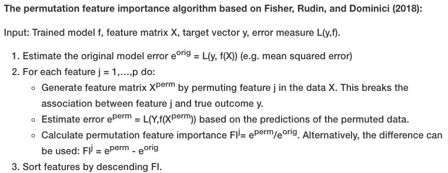
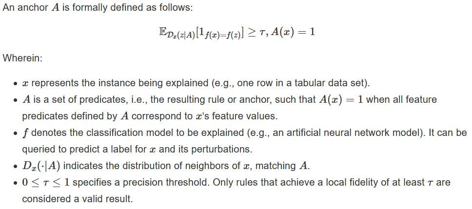

## Section 5.1 - 5.7, 5.9
Section 5.1 - 5.7 and 5.9 was written in Google Docs and converted to a PDF file ([chapter_5_old.pdf](/interpretable_ml/chapter_5_old.pdf)).

## [5.5 Permutation Feature Importance](https://christophm.github.io/interpretable-ml-book/feature-importance.html)
The author updated the original feature importance section to introduce the concept of permutation importance.

- "Permutation feature importance measures the increase in the prediction error of the model after we permuted the feature’s values, which breaks the relationship between the feature and the true outcome."

- The algorithm

    

- Advantages
  - Permutation feature importance **does not require retraining the model**. 
- Disadvantages
  - Permutation feature importance is **linked to the error of the model**. It doesn't tell how much the model's output varies for a feature, which is sometimes needed.
  - Permutation feature importance depends on shuffling the feature, which adds randomness to the measurement. When the permutation is repeated, the **results might vary greatly**. Repeating + averaging helps reduce the variance but increases the time of computation.
  - For correlated features, permutation importance **can be biased by unrealistic data instances**.

## [5.8 Scoped Rules (Anchors)](https://christophm.github.io/interpretable-ml-book/anchors.html)

- Anchors explains **individual predictions** of any black-box classification model by finding a decision rule (*IF-THEN*) that "anchors" the prediction sufficiently. A rule anchors a prediction if changes in other feature values do not affect the prediction.
- Formal definition of Anchor

 

