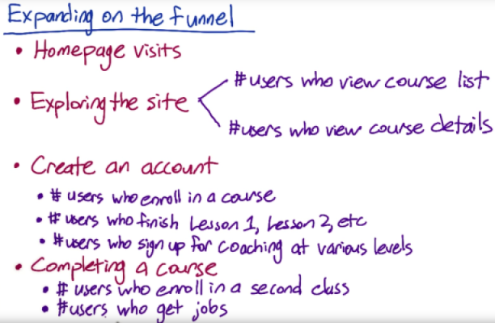
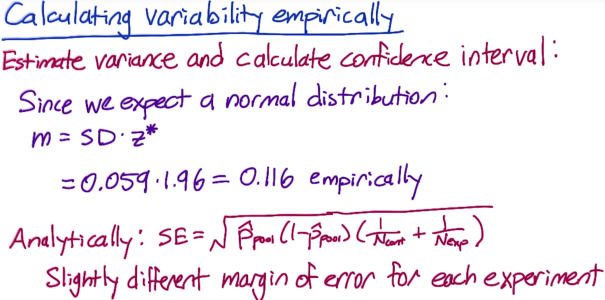

Notes on the [A/B Testing (Udacity)](https://classroom.udacity.com/courses/ud257) course.

- [Lesson 1: Overview of A/B Testing](#lesson-1-overview-of-ab-testing)
    - [1.15 Calculating confidence interval (CTR example)](#115-calculating-confidence-interval-ctr-example)
    - [1.17 Null and Alternative Hypothesis, *Two-tailed vs. One-tailed tests*](#117-null-and-alternative-hypothesis-two-tailed-vs-one-tailed-tests)
    - [1.19 Pooled Standard Error](#119-pooled-standard-error)
    - [1.21 - 24. Sample Size and Power](#121---24-sample-size-and-power)
    - [1.25 Pooled Example](#125-pooled-example)
    - [1.26 Confidence Interval Case Breakdown](#126-confidence-interval-case-breakdown)
- [Lesson 2: Policy and Ethics for Experiments](#lesson-2-policy-and-ethics-for-experiments)
    - [2.1 - 2.7. Four Principles](#21---27-four-principles)
    - [2.8 Accessing Data Sensitivity](#28-accessing-data-sensitivity)
    - [2.10 Summary of Principles](#210-summary-of-principles)
- [Lesson 3: Choosing and Characterizing Metrics](#lesson-3-choosing-and-characterizing-metrics)
    - [3.2 - 3.3 Metric Definition Overview](#32---33-metric-definition-overview)
    - [3.5 Refining the Customer Funnel](#35-refining-the-customer-funnel)
    - [3.6 - 3.7 Quizes on Choosing Metrics](#36---37-quizes-on-choosing-metrics)
    - [3.8 Other techniques for defining metrics](#38-other-techniques-for-defining-metrics)
    - [3.10 - 11 Techniques to Gather Additional Data and Examples](#310---11-techniques-to-gather-additional-data-and-examples)
    - [3.13 Metric Definition: Click Through Example](#313-metric-definition-click-through-example)
    - [3.16 - 3.17 Summary Metrics](#316---317-summary-metrics)
    - [3.18 - 3.19 Sensitivity and Robustness](#318---319-sensitivity-and-robustness)
    - [3.20 Absolute Versus Relative Differences](#320-absolute-versus-relative-differences)
    - [3.21 - 3.22 Variability](#321---322-variability)
    - [3.24-25 Empirical Variability](#324-25-empirical-variability)
- [Lesson 4: Designing an Experiment](#lesson-4-designing-an-experiment)
    - [4.2 - 4.3 Unit of Diversion Overview](#42---43-unit-of-diversion-overview)
    - [4.4 - 4.5 Consistency of Diversion](#44---45-consistency-of-diversion)
    - [4.6 - 4.7 Ethical Considerations](#46---47-ethical-considerations)
    - [4.8 - 4.9 Unity of Analysis vs. Diversion](#48---49-unity-of-analysis-vs-diversion)
    - [4.10 Inter- vs. Intra-User Experiments](#410-inter--vs-intra-user-experiments)
    - [4.11 - 4.13 Target Population, Cohort](#411---413-target-population-cohort)
    - [4.16 - 4.18 Sizing Examples](#416---418-sizing-examples)
    - [4.20 - 22. Duration vs. Exposure](#420---22-duration-vs-exposure)
    - [4.23 Learning Effects](#423-learning-effects)
- [Lesson 5: Analyzing Results](#lesson-5-analyzing-results)
    - [5.1 - 5.7 Sanity Checks (invariant metrics)](#51---57-sanity-checks-invariant-metrics)
    - [5.8 Single Metric](#58-single-metric)
- [Lesson 6: Final Project](#lesson-6-final-project)
- [Reference](#reference)

# Lesson 1: Overview of A/B Testing

### 1.15 Calculating confidence interval (CTR example)
- Let's say we have $\hat{p} = \dfrac{X}{N} = \dfrac{100}{1000}=0.1$ where $X =$ # of users who clicked, and $N=$ # of users. 
- A *Rule of Thumb* for normality is to check $N\cdot\hat{p} > 5$ (might as well check $N\cdot(1-\hat{p}) > 5$), otherwise use $t$-distribution instead of $z$-distribution.
- The *margen of error* $m=z_{\alpha/2}\cdot SE = z_{\alpha/2} \cdot \sqrt{\frac{\hat{p}(1-\hat{p})}{N}}$, notice that here $SE = \sqrt{\frac{p(1-p)}{N}}$ instead of $\sqrt{np(1-p)}$ for binomial distribution, since we use the fraction or proportion of successes instead of the total number of sucesses.
- For $\alpha=5\%$, we have $m=z_{0.025}\cdot \sqrt{\frac{0.1*0.9}{1000}} = 0.019$, and the final 95\% CI is $[0.081, 0.119]$.

### 1.17 Null and Alternative Hypothesis, *Two-tailed vs. One-tailed tests*

The null hypothesis and alternative hypothesis proposed here correspond to a two-tailed test, which allows you to distinguish between three cases:
- A statistically significant positive result
- A statistically significant negative result
- No statistically significant difference.

Sometimes when people run A/B tests, they will use a one-tailed test, which only allows you to distinguish between two cases:
- A statistically significant positive result
- No statistically significant result

Which one you should use depends on what action you will take based on the results. 

If you're going to launch the experiment for a statistically significant positive change, and otherwise not, then you don't need to distinguish between a negative result and no result, so a one-tailed test is good enough. If you want to learn the direction of the difference, then a two-tailed test is necessary.

### 1.19 Pooled Standard Error 

- We have $X_{cont}, X_{exp}, N_{cont}, N_{exp}$, and 
- Pooled sample mean $\hat{p}_{pool} = \dfrac{X_{cont} + X_{exp}}{ N_{cont} + N_{exp}}$
- Pooled sample standard error $SE_{pool} = \sqrt{\hat{p}_{pool}(1-\hat{p}_{pool})(\frac{1}{N_{cont}}+\frac{1}{N_{exp}})}$
- Test statistic $\hat{d} = \hat{p}_{exp} - \hat{p}_{cont}$
- Null hypothesis $H_0: d = 0$, under which $\hat{d}\sim \mathcal{N}(0, SE_{pool})$
- For 95% confidence level ($z_{1-0.05/2} = 1.96$), if $\hat{d} > 1.96\times SE_{pool}$ or  $\hat{d} < - 1.96\times SE_{pool}$, reject the null.

### 1.21 - 24. Sample Size and Power
- Two types of error
  - $\alpha = P$(reject null | null True)
  - $\beta = P$(not reject null | null False)
  - So if sample is small, we have low $\alpha$ and high $\beta$, i.e., harder to identify the alternative when a difference exists. On the other hand, if sample is large, $\alpha$ is the same, but $\beta$ is much lower, as shown below.
    - Sample size = 1000
    
    
    - Sample size = 5000
    
     

  - $1-\beta$ is called *sensitivity* and often choose to be $> 80\%$

- Note on power
  - Statistical textbooks often define power as the sensitivity. However, conversationally power often means the probability that your test draws the correct conclusions, which depends on both $\alpha$ and $\beta$.
- Required sample size to achieve certain statistical power can be calculated using [online calculator](https://www.evanmiller.org/ab-testing/sample-size.html), in which you need to specify $\alpha$, $\beta$, baseline conversion rate (null), and minimum detectable effect (alternative).

- Final notes on how typer I & II confidence level and detectable difference $d_min$ can determine the required sample size together is as follows

  

- Examples of factors that affect the required sample size are as follows:

    

### 1.25 Pooled Example
An pooled example is shown below, notice how the $d_{min}$ works (need the lower bond of the $1-\alpha$ level CI $> d_{min} = 0.02$)

### 1.26 Confidence Interval Case Breakdown
Shown below is the how we should consider the decision under varying CI and $d_{min}$ cases

# Lesson 2: Policy and Ethics for Experiments

### 2.1 - 2.7. Four Principles
[IRB](https://en.wikipedia.org/wiki/Institutional_review_board)'s four main principles to consider when conducting experimentats are:
- **Risk**: *what risk is the participant undertaking?*. The main threshold is whether the risk exceeds that of *“minimal risk”*. Minimal risk is defined as the probability and magnitude of harm that a participant would encounter in normal daily life. 
- **Benefit**: *what benefits might result from the study?*
- **Choice/Alternatives**: *what other choices do participants have?*
- **Privacy/Data Sensitivity**: *what data is being collected, and what is the expectation of privacy and confidentiality?* 
  - How sensitive is the data?
  - What is the re-identification risk of individuals from the data?

### 2.8 Accessing Data Sensitivity
An example of data sensitivity assessment is shown below

### 2.10 Summary of Principles
- It's a grey area whether internet studies should be subject to IRB review or not and whether informed consent is required.
- Most studies face the bigger question about data collection with regards to identifiability, privacy, and confidentiality / security.
  - Are participants facing more than minimal risk?
  - Do participants understand what data is being gathered?
  - Is that data identifiable?
  - How is the data handled?

# Lesson 3: Choosing and Characterizing Metrics
### 3.2 - 3.3 Metric Definition Overview
- *Invariant Checking*: metrics shouldn't change across experiment and control
- *Evaluation*: what do we want to use the metrics for?
  - At the evaluation stage, it's better to settle on one single objective that multiple departments within the company would most likely agree on.
  - If mutlple metrics are available or equally important, we can create a composite metric, e.g., something called objective function or OEC (Overall Evaluation Criterion, a term created by Microsoft). 
  - Composite metric is less preferred, as it is better to come up with a less optimal metric that works for a suite of A/B tests than to come up with a perfect metric but only for a single test.

### 3.5 Refining the Customer Funnel
An example of defining metrics for Udacity
- Refining the customer funnel

  
- High-level metrics
  
  

### 3.6 - 3.7 Quizes on Choosing Metrics
- How to choose metrics for different tests
  
  
- Difficult metrics
  - Don't have access to data, e.g.,
    - Amazon wants to measure average happiness of shoppers
    - Google wants to measure probability of user finding information via search
  - Takes too long to measure, e.g.,
    - Udacity measures the rate of customers who completed the 1st course returning for 2nd one.

### 3.8 Other techniques for defining metrics
- External data
- User experience research, surveys, focus groups
- Retrospective analysis helps detect correlations for us to develop theories.
- For details of additional techniques for defining metrics, see [`materials/define_metrics_additional_techniques.pdf`](materials/define_metrics_additional_techniques.pdf).

### 3.10 - 11 Techniques to Gather Additional Data and Examples
- Techniques for gather additional data

- Udacity example

- Examples where data is hard to get

### 3.13 Metric Definition: Click Through Example

- Metric definition

### 3.16 - 3.17 Summary Metrics
- Categories of summary metrics
  - Sums and counts.
    - e.g., # users who visited page
  - Means, medians, and percentiles
    - e.g., mean age of users who completed a course or 
    - median latency of page load
  - Probabilities and rates
    - Probability has 0 or 1 outcome in each case
    - Rate has 0 or more
  - Ratios
    - e.g., $\frac{P\text{(revenue-generating click)}}{P\text{(any click)}}$

### 3.18 - 3.19 Sensitivity and Robustness
- We want summary metrics to be sensitive on things we care and robust on things we don't care.
- Example: choose summary metric for latency of a video
  - Use *retrospective analysis* to check robustness. For example, if we plot distribution for similar videos and find the 95th and 99th percentiles of load time has noticeable variations between videos, those two metrics may not be **robust enough**.
  - We can also look at *experimental data*. For example, if we plot distribution of load time for videos with increasing resolution, and find that the median and 80th percentile is not affected by resolution, only the 85/90/95-th percentiles are increasing. This means that median and 80th percentile may not be sensitive enough.

### 3.20 Absolute Versus Relative Differences
- Usually start with absolute differences when we don't know the metric well.
- Using relative difference means we might be able to stick with the same significance boundary and not need to worry about seasonality factors (e.g., think about CTR for shopping websites) 

### 3.21 - 3.22 Variability
- To calculate a confidence interval, we need
  - Variance (or standard deviation)
  - Distribution
- For [Binomial distribution](https://en.wikipedia.org/wiki/Binomial_distribution)
  - $SE = \sqrt{\frac{\hat{p}(1-\hat{p})}{N}}$
  - Margin of error $m = z^*\cdot SE$, where $z$-score is derived from the standard normal distribution, as binomial approaches to normal when $N$ is large.
- Distribution and estimated variance of some common metrics are as follows

    | Type of metric                                           | distribution                                                  |       estimated variance       |
    | :------------------------------------------------------- | :------------------------------------------------------------ | :----------------------------: |
    | probability                                              | binomial (normal)                                             | $\frac{\hat{p}(1-\hat{p})}{N}$ |
    | mean                                                     | normal                                                        |   $\frac{\hat{\sigma}^2}{N}$   |
    | median/percentile                                        | depends                                                       |            depends             |
    | count/difference                                         | normal (maybe)                                                |        Var(X) + Var(Y)         |
    | rates                                                    | [poisson](https://en.wikipedia.org/wiki/Poisson_distribution) |           $\bar{X}$            |
    | ratios (e.g., $\frac{\hat{p}_{exp}}{\hat{p}_{control}}$) | depends                                                       |            depends             |
  
- Some summary metrics may be harder to analyze. E.g., median could be non-normal if data is non-normal (e.g., latency with bimodal distribution shown below)

    
  
- Example: calculate the 95% CI for a mean with N = [87029, 113407, 84843, 104994, 99327, 92052, 60684] 
  - $\bar{N} = 92,052, \hat{sigma} = 17,015$
  - $SE = \frac{\hat{\sigma}}{\sqrt{7}} = 6,430$
  - *Margin of error* $m = z^*\cdot SE = 1.96 \cdot SE = 12,605$
  - The CI is $79,158$ to $104,367$

### 3.24-25 Empirical Variability
- Uses of A/A tests
  - Compare results to what you expect (sanity check)
  - Estimate variance and calculate confidence
  - Directly estimate confidence interval
- A CTR example
  - [Spreadsheet](https://docs.google.com/spreadsheets/d/17wWNY2jkDlG9BDMYQq2l-ku_8HGajXuF2Zvy__dBEL4/edit#gid=0)
  - Estimate variance and calculate CI using pooled results

  

  - Directly estimate confidence interval from empirical distribution

  

- We can also use *bootstrap* to generate multiple samples/metrics to estiamte the variability.

# Lesson 4: Designing an Experiment

### 4.2 - 4.3 Unit of Diversion Overview
- *Unit of diversion* is how we define what an individual subject is in the experiment.
- Commonly used:
  - User id
    - Stable, unchanging
    - Personally identifiable
  - Anonymous id (cookie)
    - Changes when you switch browser or device
    - Users can clear cookies
  - Event
    - No consistent experience
    - use only for non-user-visible changes
- Less common:
  - Device id
    - only available for mobile
    - tied to specific device
    - unchangeable by user
  - IP address
    - changes when location changes
- Example
  
  

### 4.4 - 4.5 Consistency of Diversion
- First principle of choosing unit of diversion is to make sure users have consistent experience.
- If the customer wouldn't be likely to notice the change, we might want to start with event-based experiement. If learning effect is detected later, we can switch to a cookie-based experiment.
- Example

  

### 4.6 - 4.7 Ethical Considerations

- An exmaple is as follows. 
  - Notice that only the second case requires additional sthical review/consent from the user because it might comprimise the anonimity of cookie-based data.
  
  

### 4.8 - 4.9 Unity of Analysis vs. Diversion
- Unit of analysis is basically whatever your denominator of the analysis is.
- When unit of analysis and unit of diversion is not the same, the empirical variability of the metric can be significantly larger than the analytical one. See [Overlapping Experiment Infrastructure:More, Better, Faster Experimentation](http://static.googleusercontent.com/media/research.google.com/en/us/pubs/archive/36500.pdf) for more details about the following example.

  

- The quiz example.
  
  

### 4.10 Inter- vs. Intra-User Experiments
- Interleaved experiments

In an interleaved ranking experiment, suppose you have two ranking algorithms, $X$ and $Y$. Algorithm $X$ would show results $X_1, X_2, … X_N$ in that order, and algorithm $Y$ would show $Y_1, Y_2, … Y_N$. An interleaved experiment would show some interleaving of those results, for example, $X1, Y_1, X_2, Y_2, …$ with duplicate results removed. One way to measure this would be by comparing the click-through-rate or -probability of the results from the two algorithms. For more detail, see [Large-Scale Validation and Analysis of Interleaved Search Evaluation](http://www.cs.cornell.edu/people/tj/publications/chapelle_etal_12a.pdf).

### 4.11 - 4.13 Target Population, Cohort
- Using cohorts in experiments
  - When to use a cohort instead of a population:
    - Looking for learning effects
    - Examining user retention
    - Want to increase user activity
    - Anything requiring user to be established
  - Audacity example:

  

### 4.16 - 4.18 Sizing Examples
- How variability affects sizing
  
  

  

- See the [codes/empirical-sizing.r](codes/empirical-sizing.r) for code example.

- Quiz
  
  

  

### 4.20 - 22. Duration vs. Exposure
- Example

  

- When to limit exposure - quiz
  - The rule of thumb is to think about what if the worst possible impact if everything goes wrong.

  

### 4.23 Learning Effects
- Change aversion vs. novalty effect
- To measure learning effect, we need a stateful unit of diversion like a cookie or a user ID
- Better use a cohort as opposed to just a population to measure the effect of dosage (e.g., how frequent a subject sees the change)
- Risk vs. duration
- Use A/A test is useful in both pre- and post- experiment.

# Lesson 5: Analyzing Results
Outline of this section
- Sanity Checks
- Single Metric
- Multiple Metrics
- Gotchas

### 5.1 - 5.7 Sanity Checks (invariant metrics)
- Check invariant metrics
  - Check *population sizing metrics* to make sure control and experiment groups are comparable
  - Check actual invariant metrics
- Quizes
  - population sizing metrics

  

  - invariant metrics

  

  - Checking invariants

  
  
  
  

### 5.8 Single Metric
- What not to do if your results aren't significant

Carrie gave some ideas of what you can do if your results aren't significant, but you were expecting they would be. One tempting idea is to run the experiment for a few more days and see if the extra data helps get you a significant result. However, this can lead to a much higher false positive rate than you expecting! See the post ([How Not To Run an A/B Test](https://www.evanmiller.org/how-not-to-run-an-ab-test.html)) for more details. Instead of running for longer when you don't like the results, you should be sizing your experiment in advance to ensure that you will have enough power the first time you look at your results.

# Lesson 6: Final Project

# Reference
- [Evan's Awesome A/B Tools](https://www.evanmiller.org/ab-testing/)
- [Overlapping Experiment Infrastructure:More, Better, Faster Experimentation](http://static.googleusercontent.com/media/research.google.com/en/us/pubs/archive/36500.pdf)
- [Large-Scale Validation and Analysis of Interleaved Search Evaluation](http://www.cs.cornell.edu/people/tj/publications/chapelle_etal_12a.pdf)