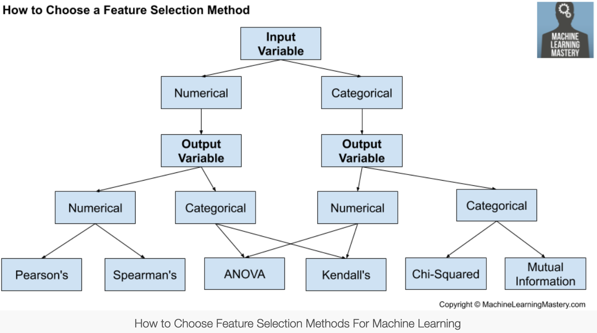

Notes on basic feature selection methods.

**Table of Content**
- [1. From `scikit-learn` User Guide](#1-from-scikit-learn-user-guide)
    - [1.1. Remove low-variance features](#11-remove-low-variance-features)
    - [1.2. Univariate feature selection](#12-univariate-feature-selection)
    - [1.3. Recursive feature elimination (RFE)](#13-recursive-feature-elimination-rfe)
    - [1.4. Model-based feature selection](#14-model-based-feature-selection)
    - [1.5. Feature selection as a pipeline](#15-feature-selection-as-a-pipeline)
- [2. Filter-Based (Univariate) Feature Selection](#2-filter-based-univariate-feature-selection)
    - [2.1. Choose statistical measures based on feature types](#21-choose-statistical-measures-based-on-feature-types)
    - [2.2 Notes on statistical measures](#22-notes-on-statistical-measures)
- [References](#references)

# 1. From `scikit-learn` User Guide

`scikit-learn` has a feature selection section in its user guide ([link](https://scikit-learn.org/stable/modules/feature_selection.html)), which provides basic feature selection functionalities.

### 1.1. Remove low-variance features
- Implemented in [`sklearn.feature_selection.VarianceThreshold`](https://scikit-learn.org/stable/modules/generated/sklearn.feature_selection.VarianceThreshold.html#sklearn.feature_selection.VarianceThreshold), . Notice that variance threshold is not just arbitrary and could have statistical basis. 
  - For example, suppose that we have a dataset with boolean features, and we want to remove all features that are either one or zero (on or off) in more than 80% of the samples. Boolean features are **Bernoulli** random variables, and the variance of such variables is given by $\text{Var}[X]=p(1-p)$ where $p=0.8$.

### 1.2. Univariate feature selection
Commonly used best univariate feature selectors include the following:

- [`SelectKBest(score_func=<function f_classif>, k=10)`](https://scikit-learn.org/stable/modules/generated/sklearn.feature_selection.SelectKBest.html#sklearn.feature_selection.SelectKBest) removes all but the $k$ highest scoring features.
- [`SelectPercentile(score_func=<function f_classif>, percentile=10`](https://scikit-learn.org/stable/modules/generated/sklearn.feature_selection.SelectPercentile.html#sklearn.feature_selection.SelectPercentile) removes all but a user-specified highest scoring percentage of features.

Common scoring functions based on univariate statistical tests are as follows:

- For regression tasks (continuous target):
  - [`f_regression`](https://scikit-learn.org/stable/modules/generated/sklearn.feature_selection.f_regression.html#sklearn.feature_selection.f_regression) computes the p-value and F-value of fitted univariate regression model between feature and continuous target.
  -  [`mutual_info_regression`](https://scikit-learn.org/stable/modules/generated/sklearn.feature_selection.mutual_info_regression.html#sklearn.feature_selection.mutual_info_regression) estimates mutual information for a continuous target variable.
- For classification tasks (label target): 
  - [`chi2`](https://scikit-learn.org/stable/modules/generated/sklearn.feature_selection.chi2.html#sklearn.feature_selection.chi2) computes chi-squared stats between each non-negative feature and class
  - [`f_classif`](https://scikit-learn.org/stable/modules/generated/sklearn.feature_selection.f_classif.html#sklearn.feature_selection.f_classif) computes the ANOVA F-value for the provided sample.
  - [`mutual_info_classif`](https://scikit-learn.org/stable/modules/generated/sklearn.feature_selection.mutual_info_classif.html#sklearn.feature_selection.mutual_info_classif) estimates mutual information for a discrete target variable.
- An example of the comparison between `f_regression` and `mutual_info_regression` is [linked here](https://scikit-learn.org/stable/auto_examples/feature_selection/plot_f_test_vs_mi.html#sphx-glr-auto-examples-feature-selection-plot-f-test-vs-mi-py), and key result is that [mutual information](https://en.wikipedia.org/wiki/Mutual_information) works for non-linear dependencies whereas F-value or p-value only captures linear dependency.

- **TODO**: *Read on and eventually write a summary/note on [mutual information](https://en.wikipedia.org/wiki/Mutual_information),  and [Kullback–Leibler divergence](https://en.wikipedia.org/wiki/Kullback%E2%80%93Leibler_divergence)*

### 1.3. Recursive feature elimination (RFE)
- [`sklearn.feature_selection.RFE`](https://scikit-learn.org/stable/modules/generated/sklearn.feature_selection.RFE.html#sklearn.feature_selection.RFE) selects features by recursively considering smaller and smaller sets of features based on importance obtained either through a `coef_` attribute or through a `feature_importances_` attribute.
- [`sklearn.feature_selection.RFECV`](https://scikit-learn.org/stable/modules/generated/sklearn.feature_selection.RFECV.html#sklearn.feature_selection.RFECV) performs RFE in a cross-validation loop to find the optimal number of features.


### 1.4. Model-based feature selection
- [`sklearn.feature_selection.SelectFromModel`](https://scikit-learn.org/stable/modules/generated/sklearn.feature_selection.SelectFromModel.html#sklearn.feature_selection.SelectFromModel) is a meta-transformer that can be used along with any estimator that has a `coef_` or `feature_importances_` attribute after fitting. Features with corresponding `coef_`/`feature_importance_` values below the provided threshold are removed.
- Typical model-based feature selection approaches include: 
  - $\ell_1$-based methods (e.g., LASSO, Support Vector Machine with regularization), and 
  - tree based methods that provide `feature_importances_`


### 1.5. Feature selection as a pipeline
Feature selection is usually used as a pre-processing step before doing the actual learning. The recommended way to do this in `scikit-learn` is to use a [`sklearn.pipeline.Pipeline`](https://scikit-learn.org/stable/modules/generated/sklearn.pipeline.Pipeline.html#sklearn.pipeline.Pipeline) as follows:
```Python
clf = Pipeline([
  ('feature_selection', SelectFromModel(LinearSVC(penalty="l1"))),
  ('classification', RandomForestClassifier())
])
clf.fit(X, y)
```

# 2. Filter-Based (Univariate) Feature Selection
### 2.1. Choose statistical measures based on feature types
> *Filter methods evaluate the relevance of the predictors outside of the predictive models and subsequently model only the predictors that pass some criterion.* - Page 490, [Applied Predictive Modeling, 2013](https://amzn.to/2Q1EONw).

- Depending on the type of the input / output variable, statistical metrics / methods for filter-based univariate feature selection are as follows (image retrieved from [a Machine Learning Mastery article](https://machinelearningmastery.com/feature-selection-with-real-and-categorical-data/)):



### 2.2 Notes on statistical measures
- [Pearson's correlation coefficient](https://en.wikipedia.org/wiki/Pearson_correlation_coefficient) measures linear dependence
  - Formula is $\rho_{X,Y}=\frac{\mathbf{Cov}(X, Y)}{\sigma_X \sigma_Y}$, i.e., covariance divided by standard deviation.
  - In sklearn, Pearson's can be computed using [`sklearn.feature_selection.f_regression`](https://scikit-learn.org/stable/modules/generated/sklearn.feature_selection.f_regression.html)
- [Spearman's correlation coefficient](https://en.wikipedia.org/wiki/Spearman%27s_rank_correlation_coefficient) is a nonparametric measure of rank correlation (statistical dependence between the rankings of two variables).
  - The formula is $r_s = \rho_{\text{rg}_X, \text{rg}_Y}=\frac{\mathbf{Cov}(\text{rg}_X, \text{rg}_Y)}{\sigma_{\text{rg}_X} \sigma_{\text{rg}_Y}}$, where $\text{rg}_X$ is the rank variable of $X$.
  - Usually used to measure the correlation between [ordinal variables](https://en.wikipedia.org/wiki/Ordinal_data).
- [ANOVA](https://en.wikipedia.org/wiki/Analysis_of_variance) can be used to rank the univariate importance of numeric variables on categorical target using the F-value, which is computed by [`sklearn.feature_selection.f_classif`](https://scikit-learn.org/stable/modules/generated/sklearn.feature_selection.f_classif.html) in sklearn.
- 

TODO: finish the notes based on the article [How to Choose a Feature Selection Method For Machine Learning](https://machinelearningmastery.com/feature-selection-with-real-and-categorical-data/)


# References
- [Scikit-learn User Guide 1.13. Feature selection](https://scikit-learn.org/stable/modules/feature_selection.html)
- [wiki - Mutual Information](https://en.wikipedia.org/wiki/Mutual_information)
- [Jason Brownlee - How to Choose a Feature Selection Method For Machine Learning](https://machinelearningmastery.com/feature-selection-with-real-and-categorical-data/)