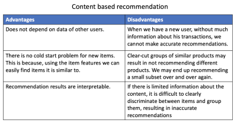
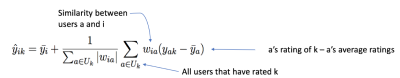
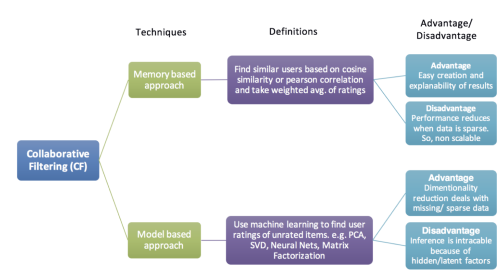

Introductory articles I read about recommender system.

### [Neerja Doshi: Recommendation Systems — Models and Evaluation](https://towardsdatascience.com/recommendation-systems-models-and-evaluation-84944a84fb8e)
- **Content-based** recommendation: " we match users to the content or items they have liked or bought". The *aim* is to create a profile for each user and each item
  - (Using example of article recommendation) Item vector: tf-idf score for each word in the vocabulary ($N\times 1$).
  - User vector: probability of the word occuring (high tf-idf score) in articles that the user has consumed. ($N\times 1$)
  - **Similarity measure**: compute similarities between user vector and any item vector using *cosine similarity* (numeric vectors). Jaccard similarity can be used to compare item-item vectors containing binary values.
  - Content-based recoomendation can be treated as supervised machine learning problems.
  - Summary of content-based method by the author
    
    

- **User-based / Collaborative Filtering** recommendation : assumes that if A and B tend to buy similar products, then A is more likely to buy a product that B has bought than a random product. 
    - **Memory-based approach**
    
        

    - **Model-based** approach uses matrix factorization methods. This is more useful when we have a ton of data and it has high sparsity.
    - Comparison of memory-based and model-based 

        

- Evaluation metrics
  - Precision ($P$) and recall ($R$)
    - $P=\dfrac{\text{\# of recommendations that are relevant}}{\# of items recommended}$
    - $R=\dfrac{\text{\# of recoommendations that are relevant}}{\# of all possible relevant items}$
  - In order to add ordering to P-R, we use precisionand recall at cutoff $k$.
    -  precision and recall calculated by considering only the subset of your recommendations from rank 1 through $k$, where the rank is determined by the predicted score.
    -  Use precision@$k$, we can calculate the Average Precision (@$m$) of the recommendations for a single user given there are $m$ actual relevant items.
    -  We can further calculate the Mean Average Precision@$m$ across all users.
